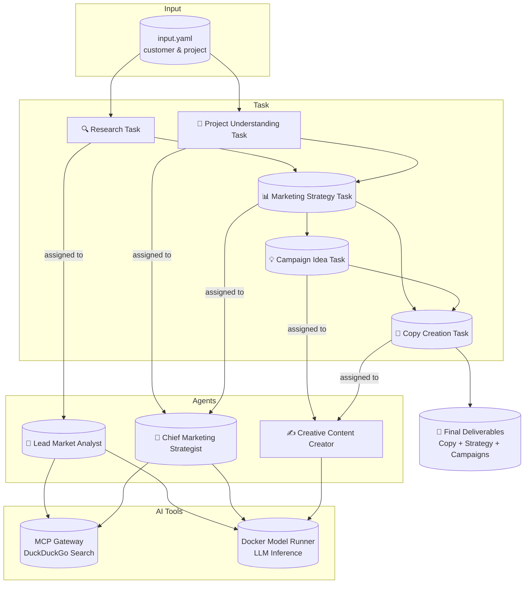

# 🧠 CrewAI Marketing Team Demo

This project showcases an autonomous, multi-agent **virtual marketing team** built with
[CrewAI](https://github.com/joaomdmoura/crewAI). It automates the creation of a high-quality, end-to-end
marketing strategy — from research to copywriting — using task delegation, web search, and creative
synthesis.

> [!Tip]
> ✨ No configuration needed — run it with a single command.

<p align="center">
  
</p>

## 🚀 Getting Started

### Requirements

+ **[Docker Desktop] 4.43.0+ or [Docker Engine]** installed.
+ **A laptop or workstation with a GPU** (e.g., a MacBook) for running open models locally. If you
  don't have a GPU, you can alternatively use **[Docker Offload]**.
+ If you're using [Docker Engine] on Linux or [Docker Desktop] on Windows, ensure that the
  [Docker Model Runner requirements] are met (specifically that GPU
  support is enabled) and the necessary drivers are installed.
+ If you're using Docker Engine on Linux, ensure you have [Docker Compose] 2.38.1 or later installed.

### Run the Project

```sh
docker compose up --build
```

That’s all. The agents will spin up and collaborate through a series of predefined roles and tasks to
deliver a complete marketing strategy for the input project.

# 🧠 Inference Options

This project supports multiple LLM providers. You can choose between running a local model using Docker Model Runner (default), or using the OpenAI or Gemini APIs.

### Local Model (Qwen)

By default, this project uses [Docker Model Runner] to handle LLM inference locally with the Qwen model. No internet connection or external API key is required.

To run with the local model, use the following command:
```sh
docker compose up --build
```

### OpenAI

To use the OpenAI API, follow these steps:

1.  Create a `secret.openai-api-key` file in the `crew-ai` directory with your OpenAI API key:

    ```plaintext
    sk-...
    ```

2.  Run the project with the OpenAI configuration:

    ```sh
    docker compose -f compose.yaml -f compose.openai.yaml up --build
    ```

### Gemini

To use the Gemini API, follow these steps:

1.  Create a `secret.gemini-api-key` file in the `crew-ai` directory with your Gemini API key.

2.  Run the project with the Gemini configuration:

    ```sh
    docker compose -f compose.yaml -f compose.gemini.yaml up --build
    ```

## ❓ What Can It Do?

Give it a company and a project description — the agents will collaborate to produce a full marketing strategy:

+ “Research the market landscape around CrewAI’s automation tools.”
+ “Understand the target audience for enterprise AI integrations.”
+ “Formulate a high-impact marketing strategy with KPIs and channels.”
+ “Propose 5 creative campaigns tailored to tech decision-makers.”
+ “Write compelling ad copy for each campaign idea.”

From strategy to storytelling, the team handles it all — autonomously.

You can **customize the tasks** to use your own domain and project description — just edit the inputs in `src/marketing_posts/config/input.yaml`.

# 👥 Virtual Team Structure

| **Agent**                      | **Role**                       | **Responsibilities**                                                   |
| ------------------------------ | ------------------------------ | ---------------------------------------------------------------------- |
| **Lead Market Analyst**        | 🧠 lead_market_analyst        | Performs in-depth research on the customer, competitors, and audience. |
| **Chief Marketing Strategist** | 🎯 chief_marketing_strategist | Designs the complete marketing strategy using team insights.           |
| **Creative Content Creator**   | ✍️ creative_content_creator  | Writes compelling ad copy based on campaign ideas.                     |
| **Chief Creative Director**    | 👑 chief_creative_director    | Reviews and approves all outputs for alignment and quality.            |

# 🧱 Project Structure

| File/Folder    | Purpose                                                |
| -------------- | ------------------------------------------------------ |
| `compose.yaml` | Defines service orchestration.                         |
| `Dockerfile`   | Builds the container environment.                      |
| `src/config`   | Contains the agent, task definitions, and task inputs. |
| `src/*.py`     | Main program and crew definition.                      |

# 🔧 Architecture Overview



+ The LangGraph-based agent transforms questions into SQL.
+ PostgreSQL is populated from a SQLite dump at runtime.
+ All components are fully containerized for plug-and-play usage.

# 🧹 Cleanup

To stop and remove containers and volumes:

```sh
docker compose down -v
```

# 📎 Credits

+ [crewAI]
+ [crewAI Marketing Strategy Example](https://github.com/crewAIInc/crewAI-examples/tree/main/marketing_strategy)
+ [DuckDuckGo]
+ [Docker Compose]

[crewAI]: https://github.com/crewAIInc/crewAI
[DuckDuckGo]: https://duckduckgo.com
[Docker Compose]: https://github.com/docker/compose
[Docker Desktop]: https://www.docker.com/products/docker-desktop/
[Docker Engine]: https://docs.docker.com/engine/
[Docker Model Runner]: https://docs.docker.com/ai/model-runner/
[Docker Model Runner requirements]: https://docs.docker.com/ai/model-runner/
[Docker Offload]: https://www.docker.com/products/docker-offload/
